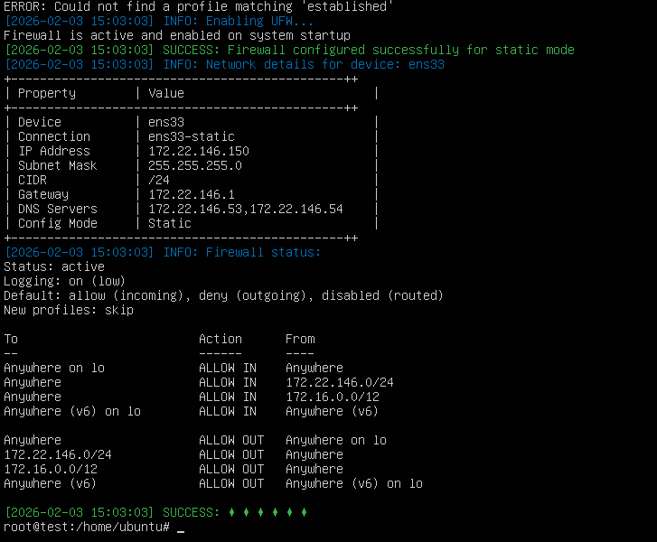
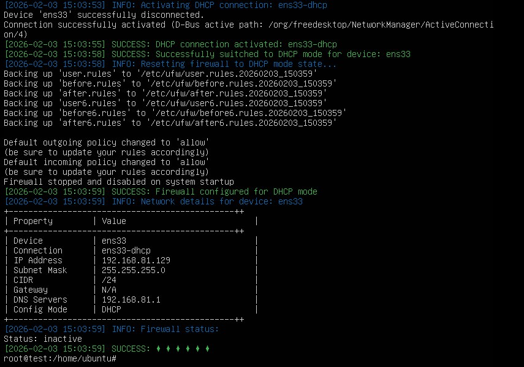

# 网络配置管理工具 (r-tool.sh)

> [!note]
>
> 1. **这个文档大部分是ai写的，有详细的使用教程**
> 2. **经过测试，发现如果linux中已存在用于网络控制的渲染器，如netplan(Ubuntu Server 22.04)或networking(debian)，请手动设置渲染器为NetworkManager，否则无法控制接口**

## 项目简介

`r-tool.sh` 是一个功能强大的网络配置管理工具，为 Redrock-SRE-2026-Ops-Winter-Assessment 的运维部分考核内容。

## 版本信息

- **当前版本**: v1.0.0 - Release
- **完成时间**: 2026-02-03
- **考核项目**: Redrock-SRE-2026-Ops-Winter-Assessment - `Ops`

## 功能特性

### 核心功能

1. **网络模式切换**
   - DHCP 自动获取模式 => **办公模式**
   - 静态 IP 配置模式 => **生产模式**
   - **自动备份和回滚机制**

2. **网络监控**
   - 手动外网连通性检查
   - 自动定时检查（systemd timer）
   - 出现越界自动切换到 DHCP 模式

3. **防火墙管理**
   - 生产模式：严格防火墙规则（不允许访问外网）
   - 办公模式：宽松防火墙规则（允许所有连接）
   - UFW 防火墙自动配置

4. **系统管理**
   - 完整的环境依赖检查
   - **自动安装缺失的工具**
   - **详细的日志记录**
   - **操作失败自动回滚**

### 技术特性

- **自动回滚机制**: 所有配置变更前自动备份，失败时自动恢复
- **彩色日志输出**: 支持多种日志级别和颜色标识
- **错误处理**: 完善的异常捕获和处理机制
- **Systemd 集成**: 支持系统级定时任务管理

## 系统要求

### 操作系统

- Linux 系统（推荐 Ubuntu/Debian）
- Systemd 服务管理器
- Bash 4.0 或更高版本

### 依赖软件

| 软件 | 用途 | 自动安装 |
|------|------|----------|
| net-tools | ifconfig 命令 | 是 |
| network-manager | nmcli 网络管理 | 是 |
| ufw | 防火墙管理 | 是 |
| systemd | 系统服务管理 | 系统自带 |

## 安装与使用

### 1. 设置执行权限

```bash
chmod +x r-tool.sh
```

### 2. 运行脚本

```bash
# 必须使用 root 权限运行
sudo ./r-tool.sh [选项]
```

## 命令参数说明

### 基本选项

| 选项 | 长选项 | 参数 | 说明 |
|------|---------|------|------|
| `-d` | `--device` | `<设备名>` | 指定网络设备（默认: eth0） |
| `-h` | `--help` | 无 | 显示帮助信息 |

### 网络配置选项

| 选项 | 长选项 | 参数 | 说明 |
|------|---------|------|------|
| `-m` | `--dhcp-mode` | 无 | 切换到**办公**模式 |
| `-s` | `--static-mode` | 无 | 切换到**生产**模式 |

### 网络监控选项

| 选项 | 长选项 | 参数 | 说明 |
|------|---------|------|------|
| `-c` | `--self-check` | 无 | 执行外网连通性检查 |
| `-on` | `--on-self-check` | 无 | 启用自动网络自检计时器 |
| `-off` | `--off-self-check` | 无 | 禁用自动网络自检计时器 |

### 信息查询选项

| 选项 | 长选项 | 参数 | 说明 |
|------|---------|------|------|
| `-i` | `--net-info` | 无 | 显示网络设备详细信息 |
| `-st` | `--status` | 无 | 显示系统当前状态 |

## 使用示例

### 1. 查看帮助信息

```bash
sudo ./r-tool.sh --help
# 或
sudo ./r-tool.sh -h
```

### 2. 查看网络设备信息

```bash
# 查看默认设备 (eth0) 的信息
sudo ./r-tool.sh --net-info

# 查看指定设备的信息
sudo ./r-tool.sh --device ens33 --net-info
```

### 3. 切换到 DHCP 模式

```bash
# 将 eth0 切换到 DHCP 模式
sudo ./r-tool.sh --dhcp-mode

# 指定设备切换到 DHCP 模式
sudo ./r-tool.sh --device ens33 --dhcp-mode
```

### 4. 切换到静态 IP 模式

```bash
# 将 eth0 切换到静态 IP 模式
sudo ./r-tool.sh --static-mode

# 默认静态 IP 配置:
# IP 地址: 172.22.146.150/24
# 网关: 172.22.146.1
# DNS: 172.22.146.53, 172.22.146.54
```

### 5. 执行网络连通性检查

```bash
# 检查网络连通性（测试 114.114.114.114）
sudo ./r-tool.sh --self-check

# 如果无法访问外网，自动切换到 DHCP 模式
```

### 6. 启用自动网络自检

```bash
# 启用每分钟自动检查一次的定时任务
sudo ./r-tool.sh --on-self-check

# 系统启动 1 分钟后开始执行
# 可通过 systemctl 查看状态
systemctl status network-check.timer
```

### 7. 禁用自动网络自检

```bash
# 停止并删除定时任务
sudo ./r-tool.sh --off-self-check
```

### 8. 显示系统状态

```bash
# 查看网络设备、计时器和防火墙状态
sudo ./r-tool.sh --status
```

### 9. 组合使用选项

```bash
# 指定设备并切换到 DHCP 模式
sudo ./r-tool.sh -d ens33 -m

# 指定设备并查看网络信息
sudo ./r-tool.sh --device eth0 --net-info
```

## 静态 IP 配置说明

### 默认配置

脚本使用以下默认静态 IP 配置：

| 配置项 | 值 |
|--------|-----|
| IP 地址 | 172.22.146.150 |
| 子网掩码 | 255.255.255.0 (/24) |
| 网关 | 172.22.146.1 |
| DNS 服务器 | 172.22.146.53, 172.22.146.54 |

### 修改配置

如需修改静态 IP 配置，请编辑脚本中的 `setStaticMode` 函数：

```bash
# 找到以下行并修改
ipv4.addresses 172.22.146.150/24
ipv4.gateway 172.22.146.1
ipv4.dns "172.22.146.53,172.22.146.54"
```

## 防火墙策略说明

### 生产模式

静态 IP 模式下应用以下防火墙规则：

- **默认策略**: 拒绝所有出站连接，允许所有入站连接
- **允许的连接**:
  - 本地回环接口 (lo)
  - 同一内网网段 (172.22.146.0/24)
  - 内部网络 (172.16.0.0/12)
  - 已建立的连接

### 办公模式

DHCP 模式下应用以下防火墙规则：

- **默认策略**: 允许所有出站和入站连接
- **UFW 状态**: 禁用

## 自动回滚机制

### 工作原理

1. **自动备份**: 所有配置变更前自动备份到 `/tmp/network_backup_YYYYMMDD_HHMMSS/`
2. **回滚队列**: 记录所有可逆操作到回滚队列
3. **失败恢复**: 脚本执行失败时自动执行回滚操作
4. **中断保护**: 用户中断（Ctrl+C）时自动回滚

### 备份内容

- 网络连接配置
- systemd 服务文件
- 防火墙规则

### 手动回滚

如需手动回滚，可以：

```bash
# 查看备份目录
ls -lh /tmp/network_backup_*

# 恢复网络配置
nmcli connection import type ethernet file /tmp/network_backup_YYYYMMDD_HHMMSS/eth0_original.nmconnection
nmcli connection up eth0
```

## Systemd 计时器管理

### 查看计时器状态

```bash
# 查看计时器状态
systemctl status network-check.timer

# 查看所有定时任务
systemctl list-timers

# 查看服务日志
journalctl -u network-check.service -f
```

### 计时器配置

- **执行频率**: 每分钟一次 (`*:*:00`)
- **启动延迟**: 系统启动后 1 分钟
- **持久性**: 是（错过执行会在下次启动时补执行）

### 手动管理

```bash
# 启动计时器
systemctl start network-check.timer

# 停止计时器
systemctl stop network-check.timer

# 启用开机自启
systemctl enable network-check.timer

# 禁用开机自启
systemctl disable network-check.timer
```

## 日志系统

### 日志级别

| 级别 | 说明 | 颜色 |
|--------|------|------|
| DEBUG | 调试信息 | 青色 |
| INFO | 一般信息 | 蓝色 |
| SUCCESS | 成功信息 | 绿色 |
| WARNING | 警告信息 | 黄色 |
| ERROR | 错误信息 | 红色 |
| CRITICAL | 严重错误 | 红色加粗 |

### 日志输出

默认输出到标准输出，支持以下环境变量：

```bash
# 设置日志级别
export LOG_LEVEL="INFO"

# 禁用颜色
export LOG_COLORED="false"

# 禁用时间戳
export LOG_TIMESTAMP="false"

# 禁用级别显示
export LOG_SHOW_LEVEL="false"
```

## 故障排除

### 常见问题

#### 1. 权限错误

**问题**: `Please run this script as root!`

**解决**: 使用 sudo 运行脚本
```bash
sudo ./r-tool.sh [选项]
```

#### 2. 设备不存在

**问题**: `unable to detect device eth0`

**解决**: 
- 查看可用设备
```bash
nmcli device status
```
- 使用正确的设备名称
```bash
sudo ./r-tool.sh --device ens33 --dhcp-mode
```

#### 3. NetworkManager 未运行

**问题**: `NetworkManager Service do not up`

**解决**:
```bash
# 启动 NetworkManager
sudo systemctl start NetworkManager

# 查看日志
sudo journalctl -u NetworkManager
```

#### 4. 计时器未启动

**问题**: 计时器创建但未运行

**解决**:
```bash
# 重新加载 systemd
sudo systemctl daemon-reload

# 启动计时器
sudo systemctl start network-check.timer

# 查看状态
sudo systemctl status network-check.timer
```

#### 5. 防火墙配置失败

**问题**: `Failed to enable UFW`

**解决**:
```bash
# 检查 UFW 状态
sudo ufw status

# 重置 UFW
sudo ufw --force reset

# 手动启用
sudo ufw enable
```

### 调试模式

启用详细日志输出：

```bash
# 设置日志级别为 DEBUG
export LOG_LEVEL="DEBUG"

# 运行脚本
sudo ./r-tool.sh --dhcp-mode
```

### 查看系统日志

```bash
# 查看 NetworkManager 日志
sudo journalctl -u NetworkManager -f

# 查看网络检查服务日志
sudo journalctl -u network-check.service -f

# 查看系统网络日志
sudo journalctl -u systemd-networkd -f
```

## 注意事项

### 安全建议

1. **权限管理**: 脚本需要 root 权限，请谨慎使用
2. **备份重要**: 重要操作前建议手动备份网络配置
3. **测试环境**: 建议先在测试环境验证配置
4. **网络中断**: 切换网络模式会导致短暂的网络中断

### 使用建议

1. **设备确认**: 使用前确认网络设备名称
2. **IP 冲突**: 静态 IP 需确保不与网络中其他设备冲突
3. **DNS 配置**: 根据实际网络环境修改 DNS 服务器
4. **防火墙规则**: 根据安全需求调整防火墙策略

### 限制说明

1. **仅支持 IPv4**: 当前版本仅支持 IPv4 配置
2. **单设备**: 每次操作仅支持一个网络设备
3. **静态配置**: 静态 IP 配置硬编码在脚本中

## 开发与贡献

### 代码结构

```
r-tool.sh
├── 变量定义
├── 日志系统
├── 备份与回滚
├── 环境检查
├── 网络配置
│   ├── DHCP 模式
│   └── 静态 IP 模式
├── 防火墙管理
│   ├── 静态模式规则
│   └── DHCP 模式规则
├── 网络监控
│   ├── 连通性检查
│   └── 自动计时器
├── 信息显示
│   ├── 网络信息
│   └── 系统状态
└── 主函数
```

## 许可证

本项目为 Redrock-SRE-2026-Ops-Winter-Assessment 的运维部分，遵循MIT许可证。

## 运行截图





> **Ubuntu Server 的命令行界面中中文会乱码，但是无伤大雅😋😋😋**

> **一开始我写的是没有中文的，后来给ai优化了一下，结果加了一堆中文（**
